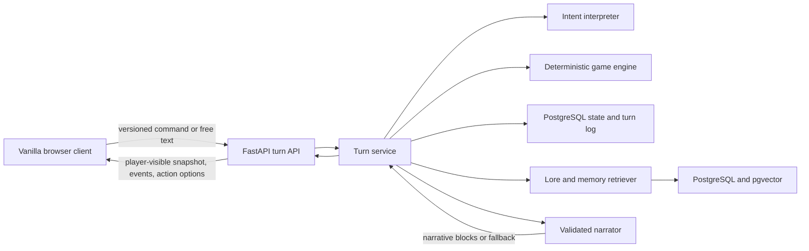

# Target Architecture

Status: canonical target for implementation
Last updated: 2026-07-11

## Executive decision

The Shimmering Wastes will be a modular monolith with a deterministic, backend-authoritative game engine. RAG and the language model enrich the experience; they do not act as the physics engine or database.

This replaces the historical PDF design in which an LLM calculates outcomes and returns state deltas. That design cannot guarantee valid currency, inventory conservation, repeatable combat, save compatibility, or narrative/state consistency.

## Architecture principles

1. **One state authority:** the backend validates commands and persists absolute, versioned game state.
2. **One rules path:** combat, travel, time, economy, inventory, progression, and quests use deterministic domain code and typed catalogs.
3. **AI behind a boundary:** free-text interpretation and narration use constrained schemas and cannot mutate state.
4. **RAG for knowledge, not arithmetic:** semantic retrieval supplies lore, voice, history, rumors, and discovered facts. Numeric mechanics use direct lookup.
5. **Playable degradation:** if retrieval or model generation fails, deterministic template narration completes the turn.
6. **Replayability:** every turn records its command, state and implementation versions, resolved events, content/rules versions, PRNG algorithm, and seed.
7. **Contract-first clients:** the frontend renders an authoritative player-visible snapshot, event list, narrative blocks, and action options.
8. **Measured AI quality:** retrieval and narration ship with evaluation datasets, latency/cost budgets, and regression gates.

## Target system



Use a modular monolith first. Microservices, Redis, agent graphs, rerankers, and streaming are later optimizations that require measured need.

## Authoritative turn lifecycle

1. The client sends `game_id`, a unique `client_request_id`, `expected_state_version`, and either an explicit command or free text.
2. An explicit choice already contains a whitelisted command and skips model interpretation.
3. Free text is interpreted into a whitelisted command and entity IDs drawn only from enabled action options and legal targets. Low-confidence or invalid interpretations return clarification rather than guessing.
4. The turn service checks guest/user ownership, request idempotency, and the expected state version.
5. Inside a short database transaction, the pure engine validates the command, uses a persisted RNG seed, resolves it, and produces domain events plus a new state snapshot.
6. The transaction stores the new state, immutable domain turn resolution, and deterministic fallback narrative. A database constraint enforces `UNIQUE(game_id, client_request_id)`. Duplicate request IDs return that resolution; stale versions return `409 Conflict`.
7. Outside the transaction, retrieval selects lore relevant to the location, entities, quest state, player knowledge, and resolved events.
8. The narrator receives the assembled context and returns validated plain-text/limited-Markdown narrative blocks. It cannot return state mutations.
9. The first validated generated narration is inserted as a separate presentation result; `UNIQUE(turn_id)` makes concurrent attempts converge and the immutable domain resolution is never rewritten. If AI work times out, crashes, or fails validation, the stored deterministic fallback remains the presentation.
10. The client receives an authoritative player-visible `GameSnapshot`, resolved events, the stored generated narrative when present or fallback otherwise, action options, turn ID, and new state version.

Never hold a database transaction open while waiting for an external model call.

## API direction

Prefer game resources and turns over a generic `/chat` endpoint:

```text
POST   /api/v1/games
GET    /api/v1/games/{game_id}
DELETE /api/v1/games/{game_id}
POST   /api/v1/games/{game_id}/turns
GET    /api/v1/games/{game_id}/turns/{turn_id}
GET    /api/v1/games/{game_id}/turns?after={cursor}
GET    /health/live
GET    /health/ready
```

Illustrative explicit-command request:

```json
{
  "client_request_id": "4b47f2e2-e13b-4ec0-9ecf-f97c55f69c86",
  "expected_state_version": 12,
  "input": {
    "type": "command",
    "command": "ATTACK",
    "parameters": {
      "ability_id": "ability.strike",
      "target_id": "encounter.ash_hound.1"
    }
  }
}
```

Illustrative response shape:

```json
{
  "game_id": "game-id",
  "turn_id": "turn-id",
  "state_version": 13,
  "game_snapshot": {},
  "events": [
    {
      "type": "DAMAGE_DEALT",
      "actor_id": "player",
      "target_id": "encounter.ash_hound.1",
      "amount": 7
    }
  ],
  "narrative": {
    "blocks": [
      {
        "speaker_id": "narrator.wastes",
        "text": "Your pipe catches the hound across its burning jaw."
      }
    ],
    "used_fallback": false
  },
  "action_options": []
}
```

The initial POST waits for a bounded narration window and returns either the validated generated presentation or the already-stored deterministic fallback. If the process or connection fails after mechanics commit, an idempotent retry returns the committed resolution and its generated presentation when present, otherwise the fallback; generation may be retried separately without resolving mechanics again. `GET /turns/{turn_id}` returns the same durable result.

Pydantic models generate the OpenAPI contract. Do not manually copy schemas into frontend source; generate or type-check the client against OpenAPI.

## Backend module boundaries

```text
backend/
  pyproject.toml
  app/
    api/
      routes/
      schemas/
    core/
      config.py
      errors.py
      logging.py
      security.py
    domain/
      commands.py
      events.py
      models.py
      engine.py
      rules/
    services/
      turn_service.py
      intent_service.py
      retrieval_service.py
      narration_service.py
    infrastructure/
      db/
      repositories/
      vector_store.py
      ai_provider.py
    content/
      ingestion.py
      schemas.py
  migrations/
  tests/
    unit/
    integration/
    contract/
    rag_eval/
```

Dependency direction is inward: API and infrastructure depend on services/domain; the domain engine does not import FastAPI, SQLAlchemy, vector libraries, or model SDKs.

## State and persistence

Use PostgreSQL with pgvector for the first RAG-enabled vertical slice so relational state, metadata filtering, full-text search, and vector search share one operational boundary. Pure engine tests must run without a database.

Initial tables:

- `games`: ID, owner/guest token hash, pinned versions, state JSONB, optimistic version, status, timestamps.
- `turns`: immutable request ID, command, PRNG seed/algorithm, domain events, deterministic fallback narrative, before/after state versions, and pinned engine/rules/content versions.
- `turn_presentations`: insert-only validated generation result with `UNIQUE(turn_id)`, prompt/narrator versions, retrieval/index metadata, latency, and usage. Absence means the turn uses its stored fallback.
- `content_versions`: immutable manifest digests and ingestion metadata.
- `index_builds`: content version, embedding model/dimensions, chunker and retrieval configuration versions, build checksum, and readiness status.
- `lore_chunks`: index build ID, stable source ID, chunk ordinal, text, metadata, embedding, and checksum.
- `player_memories`: a derived searchable projection of authoritative discovered fact IDs, tied to game ID and source turn; add after canonical retrieval is stable.

Start with a versioned game aggregate in JSONB plus an append-only turn log. This gives replay/debugging value without requiring a fully event-sourced architecture.

## Game engine contract

The central domain operation is conceptually:

```text
resolve(state, command, catalog, seeded_rng) -> TurnOutcome
```

`TurnOutcome` contains:

- A new immutable state value.
- Typed domain events.
- Legal next actions.
- Stable entity/fact IDs referenced by the events; the service-layer context assembler resolves their presentation facts from pinned catalogs.
- No prose and no database operations.

Required invariants include bounded HP/MP, nonnegative currency, inventory conservation, valid equipment slots, legal location/quest transitions, and one combat phase at a time.

Immutable recorded events replay exactly. Command-plus-seed recomputation is guaranteed only with the same engine version, rules/catalog digest, and named PRNG algorithm/version; record all of them on the turn.

## Version model

- `world_id`: stable campaign namespace, such as `shimmering_wastes`.
- `content_version`: immutable manifest digest for lore, dialogue, assets, and entity/rule source files.
- `rules_version`: immutable mechanics catalog digest.
- `engine_version`: deterministic resolver implementation version.
- `game_state_schema_version`: serialized save/state shape and migration path.
- `index_build_id`: derived retrieval build for one content version, including embedding model/dimensions, chunker version, full-text configuration, retrieval configuration, and build checksum.
- `narrator_model_version` and `prompt_version`: generation provenance, distinct from the embedding model.

Games pin state/rules/content versions. Turns pin the versions required to interpret and replay them. Existing saves never silently move to a new version; migrations are explicit and tested.

## AI boundary

Use a direct async provider SDK behind narrow interfaces first:

```text
IntentInterpreter.interpret(text, enabled_action_options) -> InterpretedCommand
Embedder.embed(texts) -> vectors
Narrator.narrate(outcome, retrieved_context, style) -> NarrativeResult
```

Add LangChain or LangGraph only when measured integration/orchestration needs outweigh another abstraction layer. The initial pipeline is intentionally predictable: retrieve, assemble bounded context, generate structured narration, validate, and fall back.

The narrator can control prose, speaker, tone, and approved presentation cues. It cannot control damage, rewards, inventory, time, quest effects, legal actions, or asset URLs.

## Frontend boundary

The target client uses semantic HTML, modular vanilla JavaScript, and project-owned CSS under the canonical design system. npm may provide tests, bundling, linting, or narrowly scoped libraries without introducing a UI framework. The client owns transient presentation state such as open panels, animation progress, input drafts, and pending/retry indicators. It does not own authoritative game rules.

The client renders a player-visible projection rather than the internal aggregate:

- `GameSnapshot` containing only information the player is allowed to know.
- `TurnEvent[]`
- `NarrativeBlock[]`
- `ActionOption[]` with `enabled` and optional `disabled_reason`; the intent interpreter receives enabled IDs only.
- Connection, conflict, retry, and fallback state

Keep a contract-compatible local adapter so frontend work and deterministic backend work can proceed independently.

## Trust and security boundaries

- Treat player text, retrieved documents, model output, save imports, and content metadata as untrusted.
- Render plain text by default. If Markdown is allowed, use a small allowlist and sanitize after rendering.
- Never render model-provided HTML, JavaScript, URLs, CSS classes, or event handlers.
- Validate content at ingest and model output at runtime.
- Keep real secrets out of Git; provide `.env.example` once variables exist.
- Use an opaque guest token in a same-origin `HttpOnly`, `Secure`, `SameSite` cookie and store only its hash server-side. Apply an explicit Origin/CSRF policy to state-changing requests. Do not put a long-lived bearer token in `localStorage`.
- Set explicit CORS, input size, rate, timeout, retry, token, and per-session cost limits before deployment.
- Filter retrieval by world ID, immutable content version, player knowledge, region, quest state, truth status, and spoiler tier.

## Observability and evaluation

Record per turn:

- Request/turn/game IDs and state versions.
- Command, events, and RNG seed.
- Retrieved source IDs, filters, scores, and content version.
- Prompt and model versions.
- Validation/fallback outcome.
- Retrieval, generation, and total latency.
- Token usage and estimated cost.

Developer tooling should expose a trace view for a selected turn without revealing hidden lore in the normal player UI.

## Failure behavior

| Failure | Required behavior |
|---|---|
| Duplicate request | Return the original turn result; do not apply twice. |
| Stale state version | Return a conflict and latest safe snapshot. |
| Invalid/illegal command | Return legal actions and a user-safe explanation. |
| Intent ambiguity | Ask a bounded clarification; do not guess a destructive action. |
| Retrieval miss | Narrate only direct outcome facts or use a template. |
| Model timeout/schema failure | Use deterministic narrative fallback. |
| Database unavailable | Do not claim the turn succeeded. Preserve retry identity. |
| Client disconnect | The committed turn remains retrievable by turn ID or an idempotent POST retry; the stored fallback is always available and a generated presentation may be appended later. |

## Migration from the current prototype

1. Capture the current visual flow and intended behavior with tests.
2. Fix or remove the unfinished dual combat/save feedback regressions before treating the prototype as a baseline.
3. Establish the Bastion Field Rig design system, split the vanilla scripts into understandable modules over time, and keep UI work behind a mock game-service boundary.
4. Port rules and catalogs into the pure Python engine, using golden fixtures from the static slice.
5. Add persistence and the turn API.
6. Replace mock calls with the typed API while retaining deterministic fallback fixtures.
7. Convert lore PDFs and frontend prose/data into versioned content sources and build the evaluated retrieval pipeline.
8. Add intent interpretation and narration only after state correctness is proven.

## Primary technical references

- [FastAPI request bodies](https://fastapi.tiangolo.com/tutorial/body/)
- [Pydantic models](https://docs.pydantic.dev/latest/concepts/models/)
- [pgvector](https://github.com/pgvector/pgvector)
- [LangChain retrieval architectures](https://docs.langchain.com/oss/python/langchain/retrieval)

## Decision records

- [ADR 0001: Deterministic backend authority](decisions/0001-deterministic-backend-authority.md)
- [ADR 0002: Foundation stack and content sources](decisions/0002-foundation-stack-and-content-sources.md)
- [ADR 0003: Vanilla frontend and learning-first scope](decisions/0003-vanilla-frontend-and-learning-first-scope.md)
